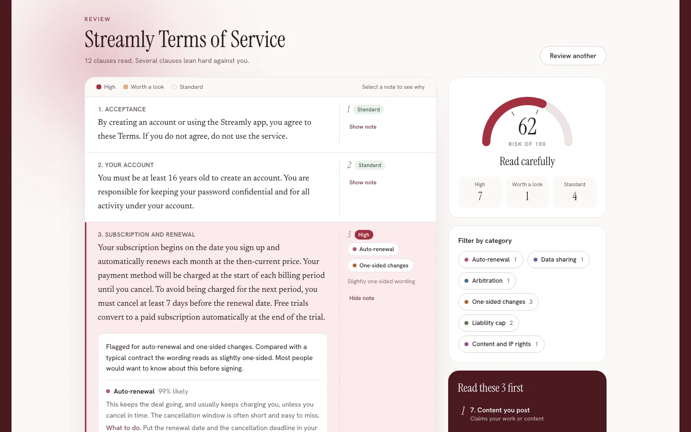

# FinePrint

Paste a contract, see it redlined by risk, and know which three clauses to read first.

**Live demo:** https://fineprint-beta.vercel.app


## How it works

FinePrint reads a contract clause by clause and marks it up like a redlined document. Paste terms of service, a lease or an offer letter, or upload a PDF. The text is split into up to 25 clauses, and each clause goes to TypeSafe Jev with nine typed questions: seven booleans for risk categories (auto-renewal, data sharing, arbitration and class action waivers, one-sided changes, fees and penalties, liability caps, content and IP rights), a score for how aggressive the clause is next to a standard contract, and a boolean for whether a typical person needs to notice it. Jev only returns numbers. FinePrint turns them into a risk tint per clause, margin flags, a document risk gauge, category filters and a "read these 3 first" list. Every explanation on the page is a template written in this repo, not model output. It is not legal advice.

## Screenshots




A longer recording is in [docs/demo.mp4](docs/demo.mp4).

## Stack

Next.js 16 (App Router), React 19, Tailwind CSS v4, TypeScript and the Vercel AI SDK, deployed on Vercel. Jev calls go through Vercel AI Gateway and fall back to the TypeSafe API. Unit tests use the Node test runner.

## Run it

```bash
npm install
cp .env.example .env.local   # add one or both keys
npm run dev                  # or: npm run build && npx next start -p 3103
npm test
```

## Config

| Variable | Default | Purpose |
| --- | --- | --- |
| `AI_GATEWAY_API_KEY` | none | Calls Jev through Vercel AI Gateway first |
| `TYPESAFE_API_KEY` | none | Direct TypeSafe API, used as fallback or on its own |
| `RATE_LIMIT_ANALYZE` | `5` | Reviews per IP per window |
| `RATE_LIMIT_EXTRACT` | `5` | PDF uploads per IP per window |
| `RATE_LIMIT_WINDOW_MS` | `3600000` | Rate limit window in milliseconds |
| `KV_REST_API_URL`, `KV_REST_API_TOKEN` | none | Upstash Redis that holds the rate limit counts |

Documents are capped at 20,000 characters and PDFs at 8MB.

Rate limit counts are global across instances because they live in Upstash Redis, keyed per app and per IP, with IPv6 grouped by /64. The window starts at your first counted request. Without the Redis variables (local dev, tests) counts fall back to memory, and if Redis is set but unreachable the API answers 503 rather than letting requests through.

## Related

Built alongside [ToneRadar](https://toneradar.vercel.app), [Headline Arena](https://headline-arena-gamma.vercel.app), [fallacy finder](https://fallacy-finder-nine.vercel.app) and [PitchPanel](https://pitchpanel.vercel.app), all on TypeSafe Jev. The first one was [JobFit](https://github.com/Sahilll15/jobfit).
